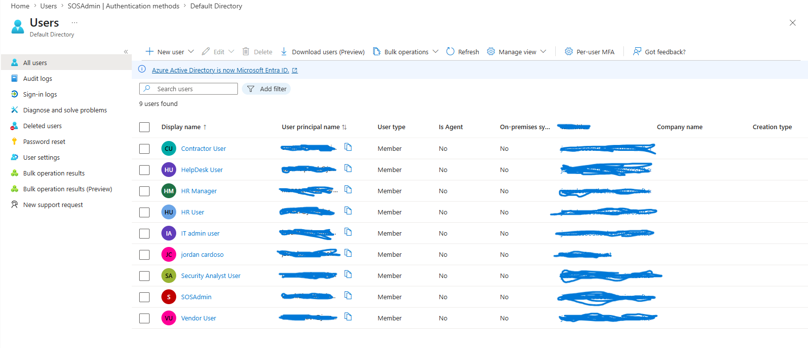
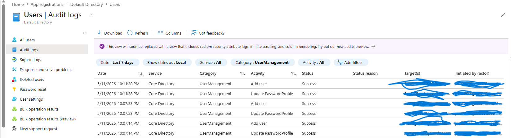

# RBAC-User-Administration-Lab-in-Microsoft-Entra-ID
Recently spent time building out a hands-on IAM lab in Microsoft Entra ID to strengthen my understanding of identity and access management concepts and gain more practical cloud security experience.
## Technologies Used
- Microsoft Entra ID
- Azure
- Conditional Access
- MFA
- RBAC
- Identity Governance
## User Managemet 

##[Groups](Groups.png)
## Audit Logs

## Skills Demonstrated

- Identity and Access Management (IAM)
- Microsoft Entra ID Administration
- Multi-Factor Authentication (MFA)
- Role-Based Access Control (RBAC)
- Conditional Access Policies
- Identity Governance
- Zero Trust Security
- Audit Log Monitoring
