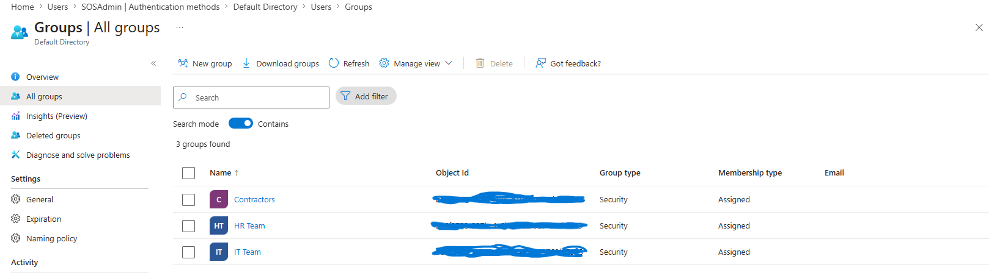

# RBAC-User-Administration-Lab-in-Microsoft-Entra-ID
Recently spent time building out a hands-on IAM lab in Microsoft Entra ID to strengthen my understanding of identity and access management concepts and gain more practical cloud security experience.
## Objective
The purpose of this lab was to configure Conditional Accees policies in Entra ID to enforce Multi Factor Authentication (MFA) for administrative accounts and better understand Zero Trust security principles. 
## Lab Tasks Performed
- Created test users
- Created administrative security groups
- Configured Conditional Access policies
- Enforced MFA requirements
- Tested authentication workflows
- Reviewed sign-in and audit logs
## Technologies Used
- Microsoft Entra ID
- Azure
- Conditional Access
- MFA
- RBAC
- Identity Governance
## User Managemet 

## Groups

## Audit Logs

## Skills Demonstrated

- Identity and Access Management (IAM)
- Microsoft Entra ID Administration
- Multi-Factor Authentication (MFA)
- Role-Based Access Control (RBAC)
- Conditional Access Policies
- Identity Governance
- Zero Trust Security
- Audit Log Monitoring

## Outcome
Successfully implemented MFA enforcement using Conditional Access policies and validated policy behavior through authentication testing and audit log monitoring.
